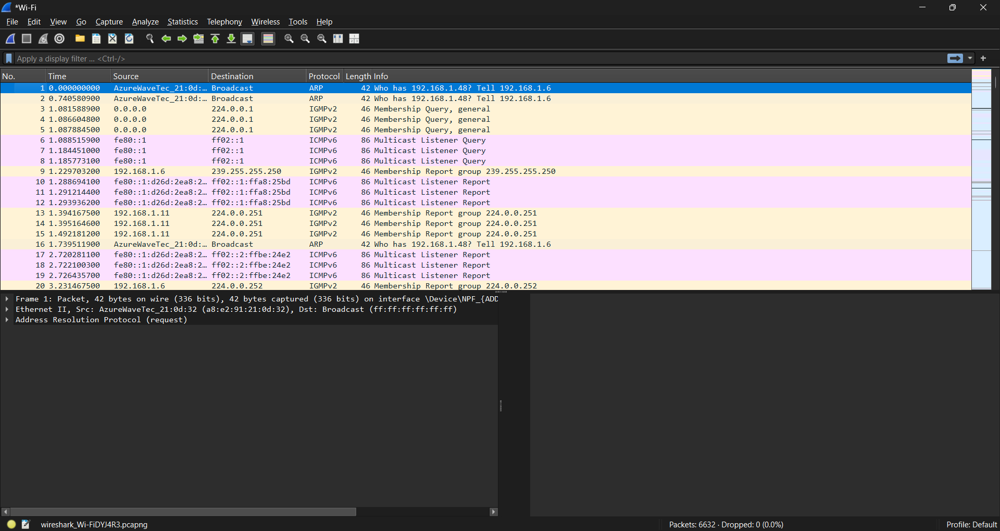
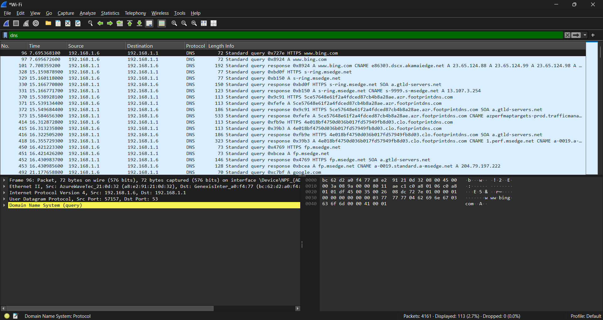
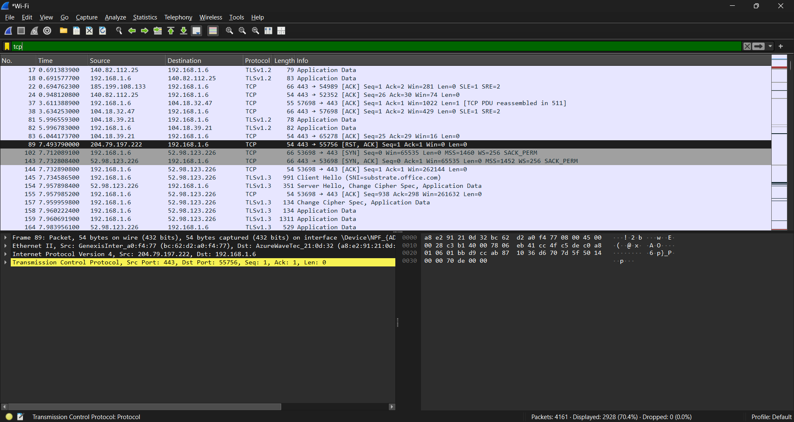
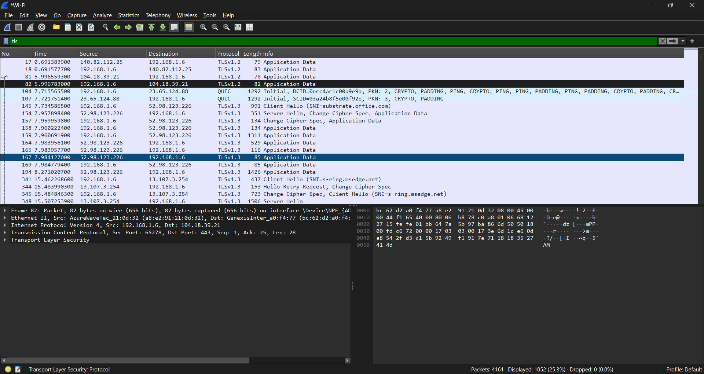
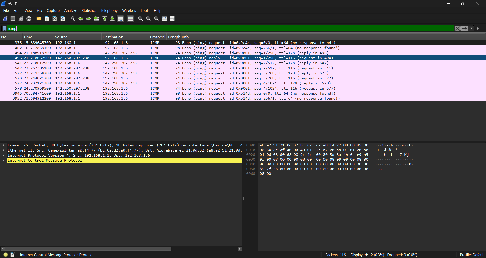
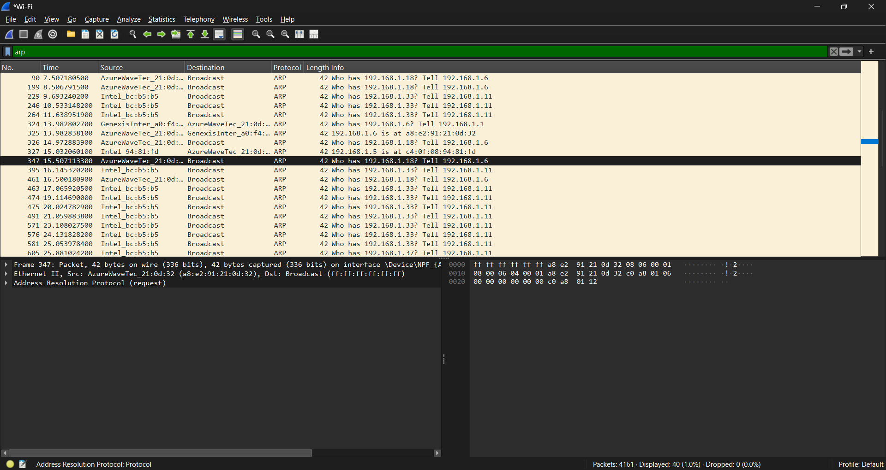

🦈 Wireshark Network Traffic Analysis
Capture • Inspect • Filter • Analyze Live Network Traffic

📖 Overview
This project demonstrates packet capture and protocol analysis using Wireshark in a Windows 11 lab environment. It covers DNS, TCP, TLS, ICMP, ARP and QUIC traffic to build packet analysis skills for SOC and Blue Team roles.
🎯 Objectives
Capture live traffic
Analyze common protocols
Apply Wireshark display filters
Understand packet structure
Practice network troubleshooting
🖥️ Lab Environment
Component	Details
OS	Windows 11
Wireshark	4.6.6
Npcap	1.88
Browser	Microsoft Edge
🛠️ Tools Used
Tool	Purpose
Wireshark	Packet capture
Npcap	Capture driver
Windows 11	Host OS
CMD	ICMP testing
🔬 Methodology
Launch Wireshark.
Select Wi-Fi interface.
Start capture.
Generate traffic.
Apply filters.
Analyze packets.
📊 Display Filters
Filter	Purpose
dns	DNS
tcp	TCP
tls	TLS
icmp	ICMP
arp	ARP
quic	QUIC
🖼️ Screenshots
Full Capture: 
DNS: 
TCP: 
TLS: 
ICMP: 
ARP: 
🔍 Key Findings
Captured live traffic successfully.
Observed DNS resolution.
Analyzed TCP communication.
Identified encrypted TLS traffic.
Examined ICMP and ARP packets.
💡 Skills Demonstrated
Packet Capture
Packet Analysis
DNS Analysis
TCP/IP
TLS
Network Troubleshooting
🎓 Learning Outcomes
Understand packet flow.
Use Wireshark display filters.
Analyze common network protocols.
📚 References
https://www.wireshark.org/docs/
https://wiki.wireshark.org/
👨‍💻 Author
Abhiram Rapothula
GitHub: https://github.com/abhiramyadav03
LinkedIn: https://www.linkedin.com/in/rapothulaabhiram/
